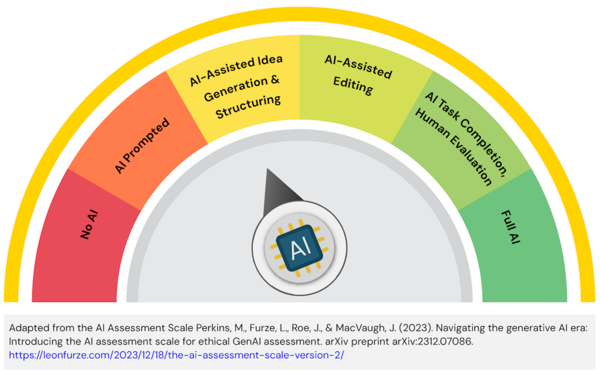

# COMP2030 Usability Evaluation, Iteration, and Demonstration

Return to Assessment Overview [README.md](../../README.md)

> [!IMPORTANT]
> All information presented here should be read within the context of the project for the semester.\
> You can find the project description in Module 1 of the FLO site.

#### TL;DR
Due date: **Monday 2pm, Week 13**
Submission Artefacts:
- Testing Plan
- Analysis
- Iteration on observations
- Presentation of refined website

## Requirements
To conduct usability testing on the constructed website (including its front-end and backend functionality), analyse findings, iterate on the design and development based on feedback, and submit the final polished website along with a reflective report.  All written report work for this assessment, **must** be completed using Markdown - for Markdown syntax, see this [linked page](https://docs.github.com/en/get-started/writing-on-github/getting-started-with-writing-and-formatting-on-github/basic-writing-and-formatting-syntax).

### Deliverables
#### Usability Testing Report
- **Usability Test Plan** (300-400 words): clear objectives for the testing process.
    - Description of the test participants (recruit at least 3-4 participants).
    - List of specific tasks participants will perform, incluing tasks that utilise the backend functionality.
    - Methodology (e.g., pre-test demographics questionnaire, SUS, SEQ, think-alound protocol, observation, other post-test questionnaire).
    - Metrics for success.
- **Testing Summary and Analysis** (500-750 words): reporting of results from the testing process.
    - Summarise the process and outcomes of your usability tests.
    - Analyse the collected data, identifying key findings, common pain points, and areas of success.
    - Prioritise at least 3-5 significant usability issues to address.
- **Iteration Description** (400-500 words): description of the changes based on the usability evaluation.
    - Detail the specific changes made to the website (design, HTML, CSS, JavaScript, PHP, MySQL) based on the usability testing feedback.
    - Provide clear justification for these changes, linking them back to the identified usability issues.
- **Appendix**: should include all required materials to recreate your UX evaluation test.
    - Script
    - Survey and/or interview questions
    - Description of tasks to be completed
    - Transcript of the UX evaluators' think out loud session and any additional comments made
    - Data captured
    - Supporting observational data (screenshots, photos, ...) 
#### Presentation of FINAL website 
- Live demonstration of the functioning website (5-7 minutes)
- Highlight key features adn the user problem it solves.
- Briefly discuss the key findings from usability testing and how they influenced the final design.

### Learning Outcomes
The Usability Evaluation, Iteration, and Demonstration submission addresses the following topic learning outcomes:
1. Determine how human factor principles and system design affects usability
2. Implement user focused software solutions through the effective inclusion of users in the design and development process
3. Construct an evaluation procedure utilising the techniques of heuristic evaluations, usability testing and experimental evaluation
4. Reflect on ethical, legal and security issues related to web applications
5. Work independently and in a team on designing, creating and maintaining applications for the web
6. Communicate effectively, using technical language with other IT professionals

### Assessment and Submission
You will be assessed on the quality, complexity, insight, and completeness of your submission.  You are required to prepare the document to demonstrate your capacity for undertaking and reporting a UX evaluation activity.

#### Marking Rubric
| Criteria | HD (85-100%) | DN (75-84%) | CR (65-74%) | P (50-64%) | F (0-49%) |
| --- | --- | --- | --- | --- | --- |
| Usability Test Plan and Execution (20%) | Exceptionally professional test plan. Testing is rigorous, insightful, and ethically conducted for all website aspects. | Comprehensive test plan for full-stack functionality. Testing is thorough and effectively executed. | Clear test plan covering front-end & backend. Testing appropriately executed. | Basic test plan, may superficially cover backend. Testing conducted but may lack rigor. | Test plan missing/poor, or doesn't cover backend. Testing not conducted or poorly executed. (30%) |
| Analysis of Findings and Prioritisation | Profound analysis, uncovering deep user insights across the stack. Excellent prioritisation of critical issues. | Insightful analysis of test data (front/back-end), clearly articulating significant issues with strong prioritisation. | Good analysis of findings (front/back-end), identifying key usability issues. Issues are reasonably prioritised. | Basic analysis. Some usability issues identified (front/back-end) but prioritisation is weak. | No analysis or superficial findings. Backend issues ignored. Issues not clearly identified/prioritised. |
| Iteration and Justification (20%) | Exemplary iteration (front/back-end) demonstrating a deep understanding of user feedback. Changes are highly impactful and expertly justified. | Significant and effective iterations (front/back-end) greatly improving usability. Strong justification for all changes. | Meaningful iterations made (front/back-end) based on test findings. Changes are clearly described and justified. | Some iteration (front/back-end) based on findings, but changes may be minor or not fully justified. | No iteration or changes are trivial/unrelated to findings. Backend issues not addressed. Justification weak/absent. |
| Final Website and Group Presentation (30%) | Exceptional, near-flawless website. High level of technical skill (front/back-end) and attention to detail. Perfect responsiveness. Outstanding, compelling presentation demonstrating full-stack competence. | Highly polished, professional website. Significant improvements. Robust functionality (front/back-end). Excellent responsiveness. Engaging, professional presentation with clear backend demo. | Well-polished website with clear improvements. All core features (front/back-end) function. Good responsiveness. Clear, well-organised presentation including backend demo. | Website functional (front/back-end) but lacks polish or clear improvements. Some bugs. Basic responsiveness. Basic presentation covering requirements; backend briefly mentioned. | Website broken, incomplete, backend non-functional. Major bugs. Poor responsiveness. Presentation disorganised, unclear, or incomplete; backend ignored. |

The work you submit should adhere to the guidelines presented here.\
Late submission of your work will incur a 5% penalty of the total marks possible per day (or part thereof) late.  Submission will not be accepted 5 days after the due date.\
The Usability Evaluation, Iteration, and Presentation is worth 25% of the overall marks for the topic.

### Academic Integrity Advisory

For this assessment task, students can use Artificial Intelligence (AI) in the development of their submission. Students are permitted to use AI to brainstorm ideas or provide ideas on structuring of documents. They cannot create written content using AI (e.g. sentences, paragraphs, etc.). Students are required to provide AI prompts used and drafts of their work and acknowledge how they used AI in their final submission.

#### How should the use of AI be acknowledged in the assessment task?
Students must submit a separate document with their video pitch.  The document should provide a declaration acknowledging which AI technologies have been used and how.  Drafts should be kept demonstrating authorship and may be requested by assessors. An appendix containing all prompts and output generated from AI should be included with the final submission.

For example: 
- I acknowledge the use of ChatGPT in the early stages of brainstorming the research ideas for this project (OpenAI, Year). The prompts and output from ChatGPT are included in Appendix A.

A reference to the use of AI should be included in the reference list. 

For example:
- (Year). ChatGPT (Month, Year, Version) [Large language model]. https://<!--comments-->chat.openai.<!--comment-->com/chat

**Academic Integrity**\
The misuse of generative AI or the failure to acknowledge the use of generative AI will be considered a breach of [Academic Integrity](https://students.flinders.edu.au/my-course/academic-integrity).

All work submitted should be the work of the authors, unless appropriately cited. Claiming work that is not your own is a breach of the University’s Academic Integrity Policy and suspected breaches will be reviewed and reported where appropriate. Penalties for breaches can range from 0 marks for the assignment, 0 marks for the topic, or expulsion from the University.