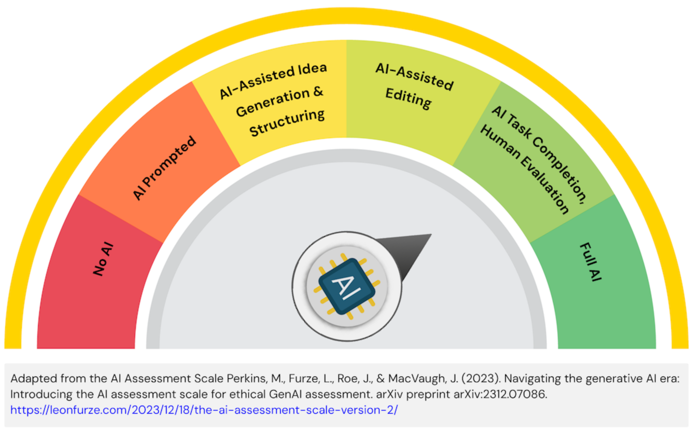

# COMP2030 Website

Return to Assessment Overview [README.md](../README.md)

> [!IMPORTANT]
> All information presented here should be read within the context of the project for the semester.\
> You can find the project description in Module 1 of the FLO site.

#### TL;DR
Due date: **Monday 2pm Week 10**\
Submission artefacts:
- Source for the website (include front- and back-end)
- Live demonstration (held during Tutorial/Workshop times)

## Requirements
To translate low-fidelity designs from the first assignment into an interactive prototype.  You will construct the core front-end of the website using HTML, CSS, and basic JavaScript, and implement a simple dynamic backend using PHP and MySQL, ensuring responsiveness.\
The website should allow interaction from each defined user role, with appropriate access privileges defined.  Suitable security considerations for sensitive data should be provided.  Appropriate CRUD operations should be implemented to allow suitable interaction.\
> [!CAUTION]
> No web frameworks, libraries, or APIs may be used.\
> The explicit exclusion of front-end libraries/frameworks (like React, Angular, Vue, jQuery) will be enforced to ensure you master core HTML, CSS, and vanilla JavaScript. The backend is focused on core PHP and MySQL.

### Deliverables
#### Website
- **Implement front-end**: using HTML, CSS, and vanilla JavaScript create an interactive experience.
- **Implement backend**: using PHP and MySQL create a dynamic, data driven experience.
- **Accessibility and responsive considerations**: demonstrate basic understanding of web accessibility and multi-device deployment.
- **Neccessary components**:
    - Interlinked HTML pages, reflecting the structure of your prototype.
    - Semantic HTML for content structure and accessibility.
    - Well organised, commented, and external CSS files.
    - Meaningful JavaScript-driven interactive features on the client-side.
    - Dynamic features driven by PHP and MySQL.
    - PHP scripts for database connection, data insertion, and/or data retrieval.
    - MySQL database designed to support the chosen dynamic features of the website.
    - Basic input sanitisation in PHP for any data received from users before database interaction.

#### Live demonstration (5 minutes)
- **Functioning website**: run through specific tasks showing the breadth of the website's capabilities.
- **Clear presentation**: well thoughout strucutre and flow for the presentation.  Presented within the required time limit.
- **Response to questions**: demonstrates familiarity with the website, addresses questions promptly, shows ownership of the development process.

### Learning Outcomes
The Website submission addresses the following topic learning outcomes:
1. Determine how human factor principles and system design affects usability
2. Implement user focused software solutions through the effective inclusion of users in the design and development process
3. ~~Construct an evaluation procedure utilising the techniques of heuristic evaluations, usability testing and experimental evaluation~~
4. Reflect on ethical, legal and security issues related to web applications
5. Work independently and in a team on designing, creating and maintaining applications for the web
6. Communicate effectively, using technical language with other IT professionals

### Assessment and Submission
You will be assessed on the quality of your implementation, your ability to document your work, and the participation and clarity of your live demonstration.  The website should be functional and support multiple user roles completing a variety of CRUD operations.  The demonstration should keep to the time limit and demonstrate the key features requested.

> [!IMPORTANT]
> When you submit your website project, you will need to export your database. This can be completed by following these steps:
> 1. In Codespaces, click on the Database extension
> 2. Navigate to the website database (will be `web_dev_db`, if you haven't changed its name in the `docker-compose.yml` file)
> 3. Right click on the database name
> 4. Select **Dump Struct and Data**
> 5. Navigate to the Root of your Codespaces (keep clicking `..` to go up a directory until `..` is no longer in the list)
> 6. Then navigate to `sql-exports` by selecting: workspaces -> COMP2030-Project -> src -> sql-exports
> 7. Click OK
> 8. Click the Source Control button in the left hand menu
> 9. Commit with message: "Final db export"
> 10. Sync the changes

#### Marking Rubric
| Criteria | HD (85-100%) | DN (75-84%) | CR (65-74%) | P (50-64%) | F (0-49%) |
| --- | --- | --- | --- | --- | --- |
| Website: HTML Structure and Semantics (10%) | Exemplary HTML structure. Excellent use of semantic markup promoting accessibility. Flawless. | Clean, well-structured, semantic HTML. Validated with very few or no errors. | Good, valid HTML structure with appropriate use of semantic tags. All pages link correctly. | Basic HTML structure, some errors. Limited use of semantic tags. Most pages link. | Poor HTML structure, many errors, little to no semantic markup. Pages may not link correctly. |
| Website: CSS Styling, Layout, and Responsiveness (15%) | Sophisticated, highly effective CSS. Flawless responsive design. Clean, efficient, maintainable CSS. | Effective and creative CSS. Website is fully responsive across common devices. Well-organised, commented CSS. | Good use of CSS for styling and layout. Website is mostly responsive. CSS is reasonably organised. | Basic CSS applied. Layout functional on one screen size, limited responsiveness. Some CSS organisation. | Minimal/ineffective CSS. Layout is broken or very basic. Not responsive. Code is disorganised. |
| Website: JavaScript and Client-Side Interactivity (20%) | Elegant, efficient JavaScript significantly enhancing client-side interactivity. Strong commitment to accessibility. Robust code. | Well-implemented, useful JavaScript enhancing UX. Good application of accessibility principles. Clean code. | Functional JavaScript for required feature. Some accessibility considerations are evident. | Basic JavaScript implemented for 1 feature, may have minor bugs. Minimal accessibility effort. | No JavaScript or non-functional/trivial scripts. No evidence of accessibility considerations. |
| Website: PHP/MySQL Backend Implementations (20%) | Elegant and efficient backend solution. Robust PHP code and database interaction. Demonstrates clear understanding of server-side logic and basic security. | Well-implemented and logical backend feature. Clean PHP code. Sensible database schema. Good input sanitisation. | Functional backend feature as required. PHP scripts work, data stored/retrieved from MySQL. Basic input sanitisation. | Basic backend feature attempted, but with significant errors or very limited functionality. PHP/DB code messy. Little/no input sanitisation. | Backend feature non-existent, non-functional, or extremely trivial. No database interaction or PHP logic. Poor security. |
| Website: Robustness (10%) | The website is exceptionally robust and handles all user inputs, including invalid or unexpected inputs, effectively. | The website is robust and handles a wide range of user inputs gracefully. | The website handles most user inputs correctly but may have issues with certain edge cases. | The website is prone to errors and crashes, especially for edge cases. | The website crashes or produces incorrect results for common user inputs. |
| Demonstration (25%) | Your demonstration of your website was exceptional and covered the required material extremely well. | Your demonstration of your website was very good and covered the required material very well. | Your demonstration of your website was good and covered the required material well. | Your demonstration of your website was appropriate but there were some issues with the delivery. | You did not provide a live demonstration during your tutorial session. |

The work you submit should adhere to the guidelines presented here.\
Late submission of your work will incur a 5% penalty of the total marks possible per day (or part thereof) late.  Submission will not be accepted 5 days after the due date.\
The Website is worth 35% of the overall marks for the topic.

### Academic Integrity Advisory



For this assessment task, students are permitted to use AI for some or most elements of the task and demonstrate effective use of AI. They are expected to evaluate output irrespective of how it is attained, include all prompts and output in an appendix, and acknowledge and cite AI created content in their final submission.

#### How should the use of AI be acknowledged in the assessment task?

Students must provide a declaration acknowledging which AI technologies have been used and how (add a file to the `src` folder, named `AI-acknowledgement.md`). Drafts should be kept demonstrating authorship and may be requested by assessors. The `AI-acknowledgement.md` file should contain all prompts and output generated from AI, and must be included with the final submission.

For example (start the `AI-Acknowledgement.md` file with the following statement):

- I acknowledge the use of ChatGPT in generating content included in this submission (OpenAI, Year). The prompts and output from ChatGPT are included in the file below.

A reference to the use of AI should be included in the reference list.

For example:

Within your reports: 

- (Year). ChatGPT (Month, Year, Version) [Large language model]. https://<!--comments-->chat.openai.<!--comment-->com/chat

Within your code:
- Immediately after lines of final code in your project where you have used AI to improve your work:
```
#-# START COMMENT BLOCK #-#
AI Tool used
Line number in AI-Acknowledgement.md where you captured this work
Your personal interpretation of the response from genAI - comment on what it means to you
#-# END COMMENT BLOCK #-#
```

**Academic Integrity**\
The misuse of generative AI or the failure to acknowledge the use of generative AI will be considered a breach of [Academic Integrity](https://students.flinders.edu.au/my-course/academic-integrity).

All work submitted should be the work of the authors, unless appropriately cited. Claiming work that is not your own is a breach of the University’s Academic Integrity Policy and suspected breaches will be reviewed and reported where appropriate. Penalties for breaches can range from 0 marks for the assignment, 0 marks for the topic, or expulsion from the University.

